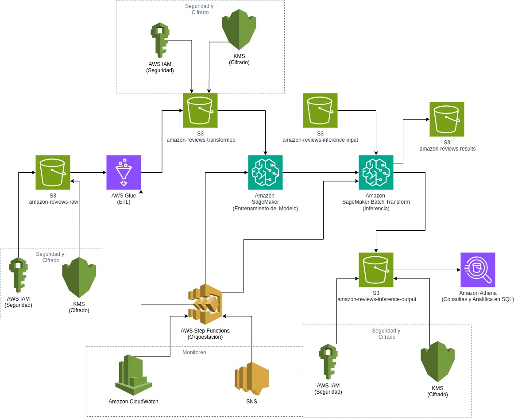

# MLOPs para análisis de sentimientos

Dataset: [Amazon Reviews Dataset](https://www.kaggle.com/datasets/kritanjalijain/amazon-reviews)


## Arquitectura propuesta



La arquitectura del proyecto tiene como objetivo desplegar un modelo de análisis de sentimientos en una infraestructura de AWS. El modelo se entrena con el dataset de Amazon Reviews.
Para ello se realiza la carga de datos crudos en un bucket de S3 (amazon-reviews-raw), para mantener medidas de seguridad se utiliza cifrado con KMS. 

Teniendo los datos crudos procedemos a realizar el proceso de ETL de los datos con AWS Glue que se encarga de transformar los datos en un formato adecuado para luego proceder a entrenar el modelo con SageMaker. Los datos procesados se almacenan en un bucket de S3 (amazon-reviews-transformed).

Luego de transformar los datos, se procede a entrenar el modelo con SageMaker con los datos extraídos del bucket de S3 (amazon-reviews-transformed), el modelo entrenado se almacena en un bucket de S3 (amazon-reviews-models).

Para realizar los procesos de inferencia en Batch, se utiliza SageMaker Batch Transform, el cual utiliza los datos nuevos de inferencia que se encuentran en un bucket de S3 (amazon-reviews-inference-input) y el modelo entrenado que se encuentra en un bucket de S3 (amazon-reviews-models) para realizar la inferencia y almacenar los resultados en un bucket de S3 (amazon-reviews-inference-output).

Los resultados de la inferencia se analizan mediante Amazon Athena, lo que permite realizar consultas SQL sobre los datos almacenados en S3 (amazon-reviews-results).

Para el tema relacionado a la seguridad y monitoreo, se utiliza principalmente KMS para cifrar los datos almacenados en S3, orquestación de los procesos con Step Functions y CloudWatch para el monitoreo de los procesos.


## Pasos para replicar el proyecto

1. Instalar CLI de Kaggle
```bash
pip install kaggle
```

2. Descargar el dataset de Kaggle
```bash
kaggle datasets download kritanjalijain/amazon-reviews
```

3. Copiar el dataset a la carpeta `data`
```bash
mkdir data
mv amazon-reviews.zip data/
```

4. Descomprimir el dataset
```bash
unzip data/amazon-reviews.zip -d data/
```

5. Desplegar el proyecto con Terraform
```bash
cd terraform/environments/dev
terraform init
terraform plan
terraform apply
```

Nota: Para desplegar el proyecto con Terraform se necesita tener una cuenta en AWS y configurar las credenciales en el archivo `~/.aws/credentials`.

6. Subir los datos de entrenamiento a S3
```bash
aws s3 cp data/train.csv s3://amazon-reviews-raw-713881824546-us-east-2/train.csv
```

7. Iniciar el pipeline de Step Functions
```bash
aws stepfunctions start-execution \
    --state-machine-arn arn:aws:states:us-east-2:713881824546:stateMachine:amazon-reviews-pipeline \
    --region us-east-2
```

8. Para monitorear la ejecución, usa el execution ARN que te devuelve el comando anterior
```bash
aws stepfunctions describe-execution \
    --execution-arn <EXECUTION_ARN> \
    --region us-east-2
```